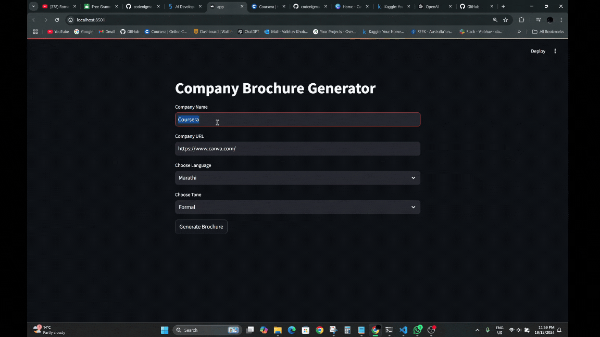
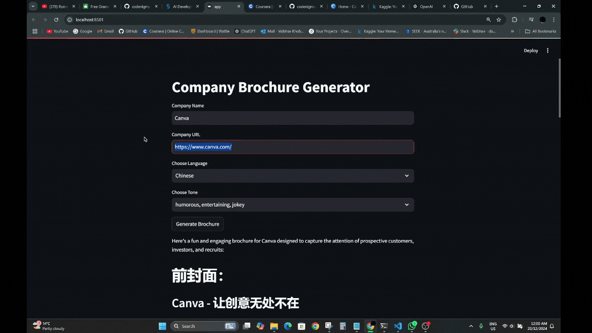

# 🌟 Company Brochure Generator

Generate multilingual, visually appealing company brochures tailored for customers, investors, and recruits. Build brochures in multiple languages and tones using AI. 🎉

---

## 🚀 Features

- **Multilingual Support**: Create brochures in languages like English, Marathi, Urdu, French, and more.
- **Customizable Tone**: Choose tones such as formal, casual, professional, and inspirational.
- **Dynamic Updates**: Stream real-time content generation directly to the user interface.
- **Markdown Support**: Brochures are output in easy-to-edit markdown format.

---

## 🎥 Demo

<p align="center">
  
  
  
</p>


## 🛠️ Setup Guidelines

Follow these steps to set up and run the project on your local machine:

### 1️⃣ Clone the Repository
```bash
git clone https://github.com/your-username/company-brochure-generator.git
cd company-brochure-generator
```

### 2️⃣ Install Dependencies
- Make sure you have Python 3.8+ installed.
- Install required Python packages:

```bash
pip install -r requirements.txt
```

### 3️⃣ Add Environment Variables
- Create a `.env` file in the root directory.
- Add your OpenAI API key:

```
OPENAI_API_KEY=your-api-key-here
```

> Ensure your API key starts with `sk-` and is valid.

### 4️⃣ Run the Application
- Launch the application using the Streamlit CLI:

```bash
streamlit run app.py
```

### 5️⃣ Access the App
- Open your browser and navigate to:
  
```
http://localhost:8501
```

---

## 📂 Project Structure

```plaintext
company-brochure-generator/
├── app.py               # Main Streamlit app
├── requirements.txt     # Python dependencies
├── utils.py             # Helper functions and classes
├── .env                 # Environment variables
├── README.md            # Project documentation
├── your-gif-file-name.gif # Demo GIF
```

---

## ✨ Contributions

We welcome contributions! Feel free to fork the repo and submit a pull request. 😄

---

## 📜 License

This project is licensed under the MIT License. See the [LICENSE](LICENSE) file for details.

---

## 🙌 Acknowledgments

Thanks to OpenAI and the open-source community for inspiring this project. 💖
